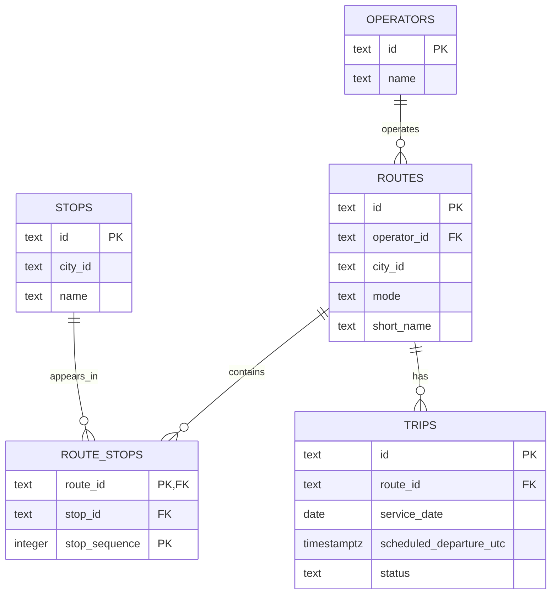

# Lecture 1 implementation lab

## Purpose

Build the smallest relational model that supports route maintenance and upcoming-trip queries. The implementation is not expected to represent the complete MobilityTicketing platform. It should make your modelling assumptions executable.

## Work in this lecture

1. Create tables for operators, routes, stops, route stops, and trips.
2. Decide the primary key of the route-stop relation and explain the decision.
3. Add primary-key and foreign-key relationships.
4. Insert the supplied seed data.
5. Write the three workload queries in `database/postgres/003_queries.sql.example`.
6. Compare the implemented schema with your ER diagram and record any difference.

## Workload queries

1. Show the next 20 scheduled trips for a route after a supplied timestamp.
2. Show the ordered stops belonging to a route.
3. Show all routes and the number of scheduled trips on a supplied service date, including routes with no trips.

## Do not implement yet

Do not add MongoDB, Redis, caching, event queues, payment logic, validation logic, reporting tables, or performance indexes. Those decisions are introduced later.

## Required evidence

- A schema that can be recreated from an empty database.
- Seed data that can be loaded more than once without manual editing.
- The three queries and representative results.
- A short note identifying one modelling assumption that may change later.
- A system context, access-pattern map, ER diagram, and one functional dependency note.

## Submission checklist

- [ ] Describe the customers, operators, and city transport context without naming a database product.
- [ ] Cover route search, ticket purchase, ticket validation, timetable updates, real-time availability, and reporting in the access-pattern map.
- [ ] Include identifiers, relationships, and cardinalities in the ER diagram.
- [ ] Explain one functional dependency and what normalization prevents.
- [ ] State what the implementation proves and what remains unknown.
- [ ] Commit the implementation under `database/postgres/`.

---

# Lecture 1 Implementation

## System context

The Mobility Ticketing system supports buses, trams, and trains in a city.

Customers can search for routes and departures, buy tickets, and validate tickets when boarding.

Transport operators maintain routes and timetables and use ticketing data for operational and reporting purposes.

## Access-pattern map

| Workload | Data needed | Characteristics |
|---|---|---|
| Journey search | Routes, stops, trips, prices, availability | Read-heavy, low latency |
| Ticket purchase | Trips, products, payments, tickets, capacity | Correctness-critical |
| Ticket validation | Tickets, validations | Latency-sensitive |
| Timetable maintenance | Routes, route stops, trips | Operator write workload |
| Real-time availability | Trips, remaining capacity | Frequently read |
| Reporting | Tickets, payments, validations | Can tolerate delayed updates |

Only route maintenance and scheduled-trip queries are implemented in Lecture 1.

## ER diagram

## Route-stop primary key

The primary key of `route_stops` is:

`(route_id, stop_sequence)`

This allows the same physical stop to appear more than once on the same route.

This can be necessary for routes that loop or revisit a stop.

Using `(route_id, stop_id)` would prevent the same stop from occurring more than once on a route.

## Functional dependency

For the `routes` relation:

`route_id -> operator_id, city_id, mode, short_name`

The route identifier uniquely determines the remaining attributes of the route.

Operators are stored separately from routes, which avoids repeating operator information for every route and helps prevent update anomalies.

## SQL model compared with ER diagram

The SQL implementation matches the ER diagram.

The `route_stops` table represents the relationship between routes and stops.

`stop_sequence` is stored in `route_stops` because the position of a stop depends on the route rather than on the stop itself.

The SQL implementation uses `(route_id, stop_sequence)` as the primary key, matching the ER diagram.

## What the implementation proves

The implementation can:

- store operators, routes, stops, and trips;
- store stops in a specific order for each route;
- find the next 20 trips for a route after a timestamp;
- show the ordered stops for a route;
- count trips for every route on a service date, including routes with no trips.

The implementation does not yet show whether the model is suitable for ticket purchases, validation, real-time availability, payments, reporting, or production-scale workloads.